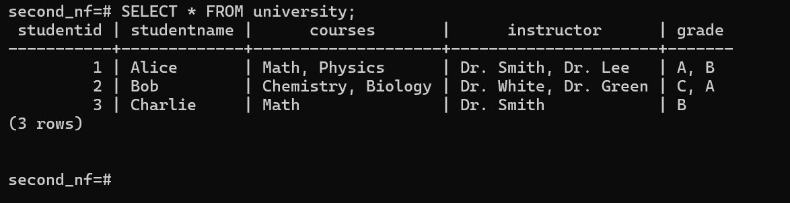
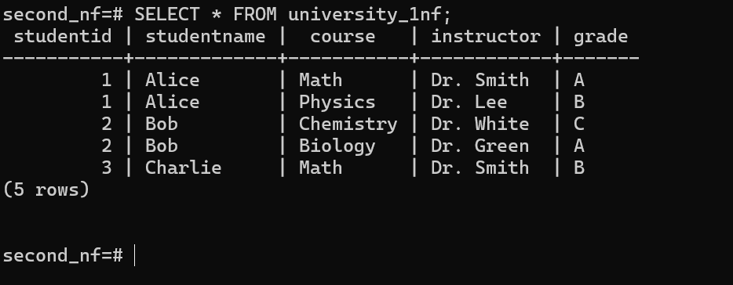
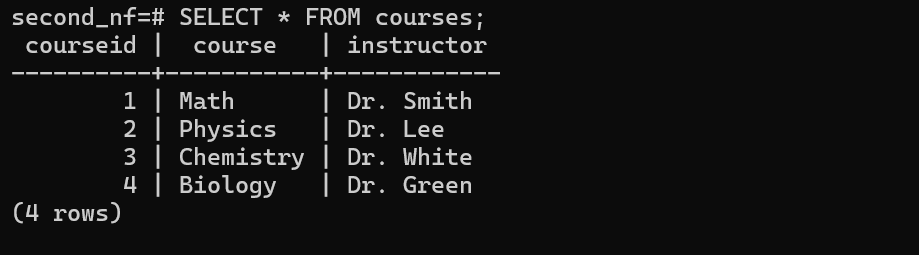
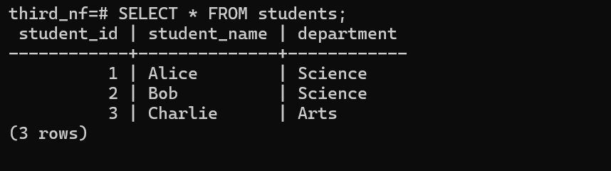
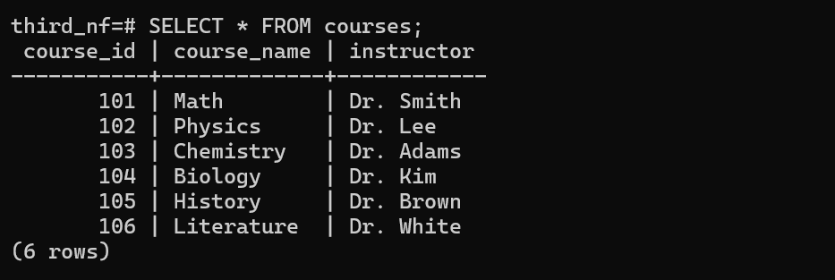

# Normalization

Its a process of designing a database effectively such that will avoid data anomalies/redundancy.

## Why Normalize?

- Minimizes duplicate data.
- Prevents update anomalies (errors when inserting, updating, or deleting data).
- Makes the database more scalable.

## Levels of Normalization/ Normal Forms

1. First Normal Form(1NF)
2. Second Normal Form(2NF)
3. Third Normal Form (3NF) - most popular
4. Fourth Normal Form (4NF)
5. Fifth Normal Form(5NF)

etc...

## Steps by step Normalizing a dataset

### 1. First Normal Form (1NF)

To ensure we are in 1NF, we need to make sure that each column has atomic values (no multiple values in a single column like “Math, Physics” for the Courses column). We would create a table where each course for a student gets its own row.

**Example: Unnormalized Table (Violates 1NF)**

**Normalized (1NF):**

To normalize this into 1NF, we need to create a new table where each row represents a single course per student.

### 2. Second Normal Form (2NF)

Here I create 4 tables: university, students, courses and student_courses. The university table is the unnormalized table that violates 1NF and 2NF, we can proceed with normalizing it step-by-step into 2NF  

Step 1: Normalize to 1NF (Separate out the values in the student, courses, instructor, and grade columns).

Step 2: Normalize to 2NF (Remove partial dependencies by separating the data into appropriate tables).

- Create a students table to store information about students, including student-id and student-name.

- Create a courses table to store information about courses, including course and instructor.

- Create a student_courses table to represent the relationship between students and courses, storing student-id, course-id, and grade.

### 3. Third Normal Form (3NF)

Step 1: Create the Unnormalized Table (UNF)
We'll create a table university where some columns contain multiple values in a single row (violating 1NF).

Step 2: Normalize to First Normal Form (1NF)
Rule: Each column must contain atomic values (no multiple values in one cell).

.png)

Step 3: Normalize to Second Normal Form (2NF)
Rule: Remove partial dependencies (columns should depend on the full primary key).

- Create a students table to store student details separately.

- Create a courses table to store course and instructor details separately.

- Create a student_courses table to represent the many-to-many relationship.

Step 4: Normalize to Third Normal Form (3NF)
Rule: Remove transitive dependencies (a non-key column should not depend on another non-key column).

- Create a departments table to store department details separately.

.png)

- Update students Table to Include department_id
Since we removed the department column and replaced it with department_id, we insert the updated records.

Final Database Schema (3NF)  
Now, the database follows 3NF and is properly structured:  

    students (student_id, student_name, department_id)
    departments (department_id, department_name)
    courses (course_id, course_name, instructor)
    student_courses (student_id, course_id, grade)

This structure eliminates redundancy, prevents anomalies, and improves data integrity.

>The same procedure is followed for 4nf, 5nf etc ..